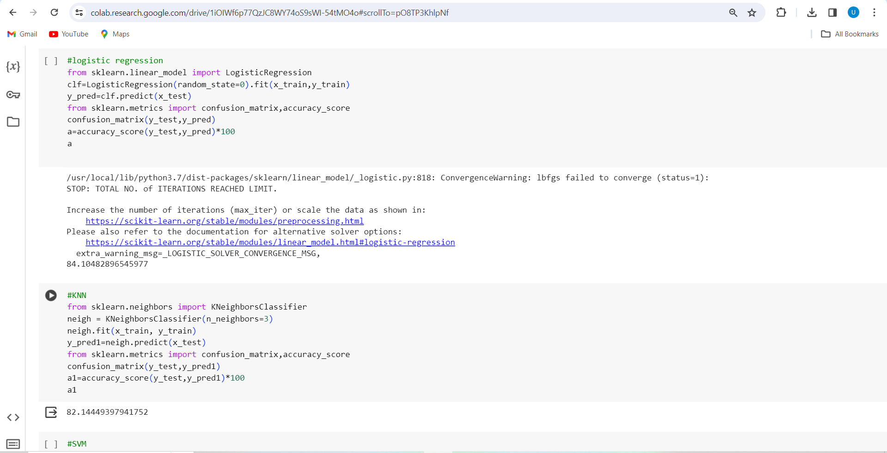
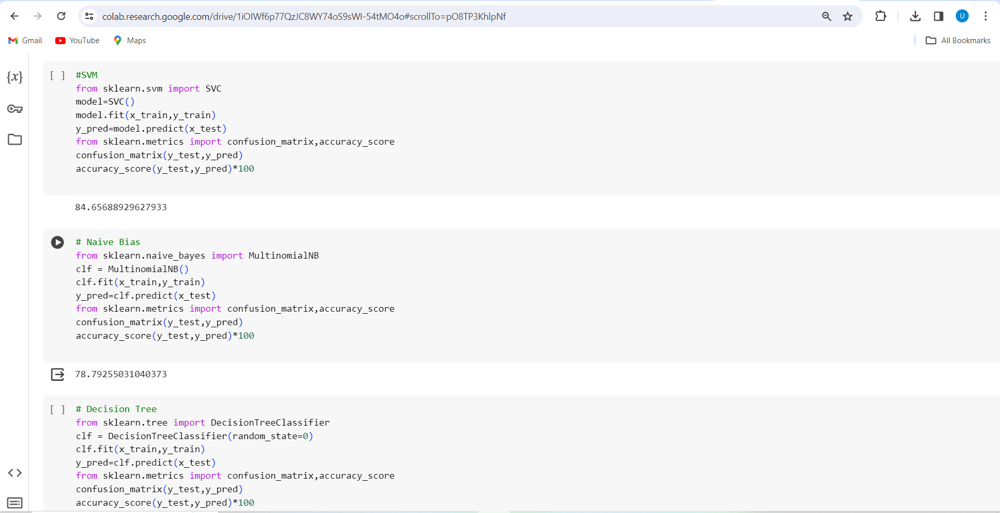
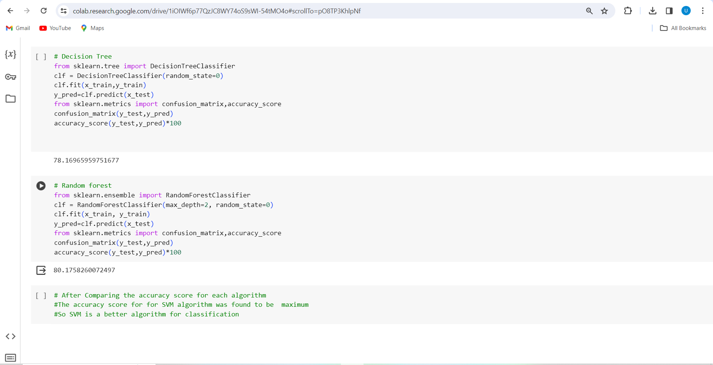

# Best Classification Algorithm 
- This was one of my project as a part of Rinex AI training and Internship
- It involves testing multiple classification models -Logistic Regression, KNN, SVM, Naive Bayes, Decision Tree and Random Forest to predict "will it rain tommorow ?" and comparing their accuracies
- The dataset used was https://www.kaggle.com/datasets/jsphyg/weather-dataset-rattle-package

# Following are the images

